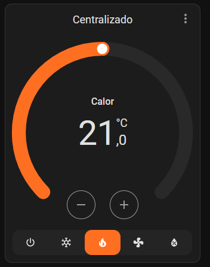

# ❄️ DKN Cloud for HASS

**Control your Daikin Airzone Cloud (dkn.airzonecloud.com) HVAC systems natively from Home Assistant.**  
Optimized for the "DAIKIN ES.DKNWSERVER Wi-Fi adapter" — climate, fan, diagnostics, and temperature at your fingertips.

<!-- Badges -->

---

## 🚀 Features

- **Fully integrated climate control:**  
  Power, mode (heat/cool/fan/dry), target temperature, and fan speed for each unit.
- **Native climate presets:**  
  Use Home Assistant **preset modes** (`home`, `away`, `sleep`) directly on the climate entity.  
  The integration maps these presets to backend fields internally — **no `select.scenary` entity**.
- **Automatic device/sensor creation:**  
  Creates climate, temperature, diagnostic, and connectivity entities for each device.
- **Sleep timer & unoccupied limits:**  
  Tune **Sleep time** via `number.sleep_time`, **unoccupied min/max** via `number.min_temp_unoccupied` / `number.max_temp_unoccupied`.
- **Privacy-sensitive sensors (opt-in):**  
  **MAC**, **PIN**, **installation/location** and related fields are available **only** when the **Expose PII identifiers** option is enabled.  
  These sensors are **not diagnostic**, remain **disabled by default**, and should be used with care.

### Passive connectivity monitor

- The integration exposes `sensor.<id>_last_connection` (timestamp, enabled by default) and `binary_sensor.<id>_wserver_online` (connectivity, enabled by default).
- Online/offline is derived **passively** from the age of `connection_date` (no extra pings).
- Option `stale_after_minutes` (default **10**) controls the threshold before considering the device offline.
- When a control request fails with HTTP **422**, Home Assistant shows: **“DKN WServer not connected (422)”**.

---

## 🧭 Mode Mapping

| P2 Value | Home Assistant Mode | Description      |
|----------|----------------------|------------------|
| `"1"`    | COOL                 | Cooling          |
| `"2"`    | HEAT                 | Heating          |
| `"3"`    | FAN_ONLY             | Ventilation only |
| `"5"`    | DRY                  | Dehumidify       |

> **About HEAT_COOL (dual setpoint / “auto”)**  
> This is **planned/experimental**. Support likely depends on device firmware/bitmask and needs **field validation**. We will gate it as **opt-in** when released and seek testers before enabling by default.

---

## ⚙️ Installation

### HACS (Default store — Recommended)
1. In Home Assistant, go to **HACS → Integrations**  
2. Search for **DKN Cloud for HASS**  
3. Click **Install** and then **Restart** Home Assistant  
4. Go to **Settings → Devices & Services → Add Integration** and search for **DKN Cloud for HASS**  
   

> **Manual (advanced; not needed when using HACS):**  
> Copy `custom_components/airzoneclouddaikin/` into your `<config>/custom_components/` folder and restart.

---

## 🔧 Configuration

After installation, go to **Settings → Devices & Services → Add Integration** and search for **DKN Cloud for HASS**.  
Enter your Airzone Cloud **username** and **password**.

**Optional parameters:**
- **Scan interval:** Data refresh interval (seconds, default: 10)
- **Expose PII identifiers:** When enabled, creates extra privacy-sensitive sensors
  (MAC, PIN, installation/location, etc.). Disabled by default.

> **No YAML required!**  
> All options are set via the Home Assistant UI.

---

## 🏷️ What You Get

- **Climate entity:**  
  - Modes: COOL, HEAT, FAN_ONLY, DRY  
  - Dynamic fan speed control  
  - **Preset modes**: `home`, `away`, `sleep` (use `climate.set_preset_mode`)
- **Sensor entities:**  
  - Current temperature (`local_temp`)  
  - Sleep timer (minutes)  
  - Diagnostics: modes, program status, slats (opt-in)
- **Switch entity:**  
  - Power ON/OFF per device
- **Number entities (config):**  
  - `number.min_temp_unoccupied` (**12–22 °C**)  
  - `number.max_temp_unoccupied` (**24–34 °C**)  
  - `number.sleep_time` (**minutes**)
- **Binary sensor entities:**
  - `binary_sensor.<id>_device_on` — reflects the device power state (enabled by default)
  - `binary_sensor.<id>_wserver_online` — passive connectivity status (enabled by default)

> Full API/command mapping and advanced usage in [info.md](./info.md).

---

## 📷 Screenshots

---

## 🧪 Compatibility

| Home Assistant | Python   | Daikin Model/Adapter         |
|----------------|----------|------------------------------|
| **2025.5+**    | **3.13.2+** | DAIKIN ES.DKNWSERVER (Cloud) |

*Other Airzone or Daikin adapters may not be supported.*

---

## 🛣️ Roadmap

- [ ] **Translations (i18n)** — translate 422 and connectivity banners; add locales (EN/ES/CA/DE/FR/IT/PL/RU/UK…)  
- [ ] **Docs** — examples for automations using **preset modes**  
- [ ] **HEAT_COOL (opt-in)** — validate across devices/firmwares before enabling  
- [ ] **Auto Fan Speed (opt-in, experimental)** — controller that selects fan speed (e.g., **P3/P4**) based on **ΔT** (discrete **1 °C** steps & hysteresis), active only in **HEAT/COOL**

---

## ❓ FAQ / Troubleshooting

**Q: How do I change scenes/presets?**  
A: Use **climate presets** on the climate entity (`preset_modes`: `home`, `away`, `sleep`) and the service **`climate.set_preset_mode`**. This supersedes the legacy `select.scenary` entity.

**Q: Will HEAT_COOL (dual setpoint / “auto”) be supported?**  
A: Planned as **opt-in** once validated on real hardware. Behavior may vary by device/bitmask/firmware.

**Q: Will there be an automatic fan speed?**  
A: Planned/experimental. It will adapt fan speed (e.g., **P3/P4**) to the **ΔT** with **1 °C** thresholds and **hysteresis**, only in **HEAT/COOL**.

**Q: Can I control vertical/horizontal slats?**  
A: Slat state/position is shown in diagnostic sensors; control is not implemented.

**Q: Where can I find advanced API usage, all device fields, and curl examples?**  
A: See [info.md](./info.md).

---

## 🤝 How to Contribute

PRs for features, **translations**, and fixes are welcome!

- Open issues and PRs in [GitHub Issues](https://github.com/eXPerience83/DKNCloud-HASS/issues)  
- For **translations**: contribute keys under `translations/` per HA guidelines  
- Follow the code style enforced by **Ruff** and **Black** (see CI)

---

## ❤️ Contributing & Support

If you find this integration useful, you can support development via:

- [Ko-fi](https://ko-fi.com/experience83)  
- [PayPal](https://paypal.me/eXPerience83)

---

### Networking & Reliability

This integration uses a per-request timeout of **30 s** and **exponential backoff with jitter** for `429/5xx`.  
If the backend is temporarily unavailable, Home Assistant retries the config entry (**ConfigEntryNotReady**).  
For privacy, logs **never** print your email or token.

---

### Authentication & Privacy

Starting with **0.4.0**:
- The legacy `select.scenary` entity is **removed**. Use climate **preset modes**: `home`, `away`, `sleep`.
- The login token is stored in `config_entry.options['user_token']`. **Home Assistant does not encrypt `config_entries` (`data` or `options`) by default**; we keep the token in Options to separate identity data (in `data`) from credentials-like settings and to reduce churn when editing options. Passwords are never persisted.

> Reauth: You’ll be asked for the account password only if the backend returns HTTP 401 or the token becomes invalid.

---

## 🙏 Acknowledgments

This project was inspired by and originally based on:

- [AirzoneCloudDaikin (PyPI)](https://pypi.org/project/AirzoneCloudDaikin/) and its Home Assistant integration by [max13fr](https://github.com/max13fr/AirzoneCloudDaikin)

Many thanks to those projects and authors for their groundwork and inspiration!

---

## 📜 License

MIT © [eXPerience83](LICENSE)

> This project is not affiliated with or endorsed by Daikin or Airzone. All trademarks are property of their respective owners.
