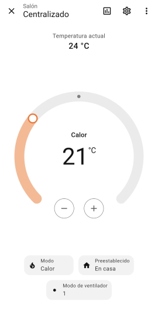

# ❄️ DKN Cloud for HASS

**Control your Daikin Airzone Cloud (dkn.airzonecloud.com) HVAC systems natively from Home Assistant.**  
Optimized for the "DAIKIN ES.DKNWSERVER Wifi adapter" — climate, fan, diagnostics, and temperature at your fingertips.

<!-- Badges -->

<!-- CodeQL: Default setup doesn't guarantee a repo workflow file, so use a static badge -->

---

## 🚀 Features

- **Fully integrated climate control:**  
  Power, mode (heat/cool/fan/dry), target temperature, and fan speed for each unit.
- **Automatic device/sensor creation:**  
  Creates climate, temperature, diagnostic, and connectivity entities for each device.
- **Preset controls ready:**  
  Adjust **Sleep time** via `number.sleep_time` and **Scenary** via `select.scenary` directly from Home Assistant.
- **Privacy-sensitive sensors (opt-in):**  
  **MAC**, **PIN**, **installation/location** and related fields are available **only** when the **Expose PII identifiers** option is enabled.  
  These sensors are **not diagnostic**, remain **disabled by default**, and should be used with care.

### Passive connectivity monitor

- The integration exposes `sensor.<id>_last_connection` (timestamp, enabled by default) and `binary_sensor.<id>_wserver_online` (connectivity, enabled by default).
- Online/offline is derived **passively** from the age of `connection_date` (no extra pings).
- Option `stale_after_minutes` (default **10**, range **6–30**) controls the threshold before considering the device offline.
- When a control request fails with HTTP **422**, the UI shows a clear error message: **“DKN WServer sin conexión (422)”**.

---

## 🧭 Mode Mapping

| P2 Value | Home Assistant Mode | Description      |
|----------|----------------------|------------------|
| `"1"`    | COOL                 | Cooling          |
| `"2"`    | HEAT                 | Heating          |
| `"3"`    | FAN_ONLY             | Ventilation only |
| `"5"`    | DRY                  | Dehumidify       |

> **About HEAT_COOL (dual setpoint / “auto”)**  
> This is **planned/experimental**. Support likely depends on device firmware/bitmask and needs **field validation**. We will gate it as **opt-in** when released and seek testers before enabling by default.

---

## ⚙️ Installation

### HACS (Custom repository — Manual)
1. Go to **HACS → Integrations**  
2. Click **⋮ → Custom repositories**  
3. **Add:** `https://github.com/eXPerience83/DKNCloud-HASS` (Category: **Integration**)  
4. **Search & install**: **DKN Cloud for HASS**  
5. **Restart** Home Assistant

---

## 🔧 Configuration

After installation, go to **Settings → Devices & Services → Add Integration** and search for **DKN Cloud for HASS**.  
Enter your Airzone Cloud **username** and **password**.

**Optional parameters:**
- **Scan interval:** Data refresh interval (seconds, default: 10)
- **Expose PII identifiers:** When enabled, creates extra privacy-sensitive sensors
  (MAC, PIN, installation/location, etc.). Disabled by default.

> **No YAML required!**  
> All options are set via the Home Assistant UI.

---

## 🏷️ What You Get

- **Climate entity:**  
  - All core modes (COOL, HEAT, FAN_ONLY, DRY)  
  - Dynamic fan speed control
- **Sensor entities:**  
  - Current temperature (`local_temp`)  
  - Sleep timer in minutes  
  - Diagnostics: modes, scenes, program status, and more (opt-in)
- **Switch entity:**  
  - Power ON/OFF per device
- **Number/Select entities (preset-related):**  
  - `number.min_temp_unoccupied` (**12–22 °C**)  
  - `number.max_temp_unoccupied` (**24–34 °C**)  
  - `number.sleep_time` (**minutes**)  
  - `select.scenary` (**occupied / vacant / sleep**)

> Full API/command mapping and advanced usage in [info.md](./info.md).

---

## 📷 Screenshots

---

## 🧪 Compatibility

| Home Assistant | Python   | Daikin Model/Adapter         |
|----------------|----------|------------------------------|
| **2025.5+**    | **3.13.2+** | DAIKIN ES.DKNWSERVER (Cloud) |

*Other Airzone or Daikin adapters may not be supported.*

---

## 🛣️ Roadmap

- [ ] **Translations (i18n)** — expose and translate all sensors/diagnostics (EN/ES/CA/DE/FR/IT/PL/RU/UK…)  
- [ ] **Docs** — examples for advanced scenes/presets and troubleshooting  
- [ ] **HEAT_COOL (opt-in)** — field validation across devices/firmwares before enabling  
- [ ] **Auto Fan Speed (opt-in, experimental)** — controller that selects fan speed (e.g., **P3/P4**) based on the **ΔT** between `local_temp` and the setpoint, with **1 °C discrete thresholds** (device reports integers), **hysteresis** to avoid chatter, and **active only in HEAT/COOL** (not in FAN_ONLY/DRY/OFF)

*(Some diagnostics and extra sensors are already implemented; future work focuses on localization and UX details.)*

---

## ❓ FAQ / Troubleshooting

**Q: What about scenes/presets? Can I change them from HA?**  
A: Yes. The integration exposes a **Scenary** selector as `select.scenary` (`occupied`, `vacant`, `sleep`).
You can also tune the related knobs — **Unoccupied Min/Max temperature** and **Sleep time** — directly from Home Assistant.

**Q: Will HEAT_COOL (dual setpoint / “auto”) be supported?**  
A: It is **planned** and will be introduced as **opt-in** once validated on real hardware. Behavior may vary by device/bitmask/firmware. If your unit supports it and you want to help test, please open an issue.

**Q: Will there be an automatic fan speed?**  
A: Yes, it’s **planned/experimental**. The idea is to adapt fan speed (e.g., **P3/P4**) to the **ΔT** between room temperature and the target setpoint, using **1 °C** thresholds and **hysteresis**. It will operate only in **HEAT/COOL** modes.

**Q: Can I control vertical/horizontal slats?**  
A: Slat state/position is shown in diagnostic sensors; control is not implemented but fields are exposed for advanced users.

**Q: Where can I find advanced API usage, all device fields, and curl examples?**  
A: See [info.md](./info.md).

---

## 🤝 How to Contribute

Pull requests for features, **translations**, and fixes are welcome!

- Open issues and PRs in [GitHub Issues](https://github.com/eXPerience83/DKNCloud-HASS/issues)  
- For **translations**: contribute keys under `translations/` with ISO language codes, aligning with Home Assistant guidelines  
- Follow the code style enforced by **Ruff** and **Black** (see CI status above)

---

## ❤️ Contributing & Support

If you find this integration useful, you can support development via:

- [Ko-fi](https://ko-fi.com/experience83)  
- [PayPal](https://paypal.me/eXPerience83)

---

### Networking & Reliability

This integration uses a per-request timeout of **30 s** and **exponential backoff with jitter** for `429/5xx` responses.  
If the backend is temporarily unavailable, Home Assistant will retry the config entry startup (**ConfigEntryNotReady**).  
For privacy, logs **never** print your email or token.

---

## 🧰 Development status

- **Python:** 3.13.2+  
- **CI:** Ruff + Black on Python 3.13 (latest patch) with a guard for `>= 3.13.2`  
- **Actions:** Using `actions/checkout@v5` (Node 24 runtime)  
- **Security:** GitHub **CodeQL** code scanning is enabled (default setup)

---

## 🙏 Acknowledgments

This project was inspired by and originally based on:

- [AirzoneCloudDaikin (PyPI)](https://pypi.org/project/AirzoneCloudDaikin/) and its Home Assistant integration by [max13fr](https://github.com/max13fr/AirzoneCloudDaikin)

Many thanks to those projects and authors for their groundwork and inspiration!

---

## 📜 License

MIT © [eXPerience83](LICENSE)

> This project is not affiliated with or endorsed by Daikin or Airzone. All trademarks are property of their respective owners.
